# MNIST CNN Visualization and Analysis

This repository contains tools for visualizing and analyzing a CNN trained on the MNIST dataset. It includes two main components: Layer Visualization and Neuron Attribution Analysis.

Model Accuracy and loss:
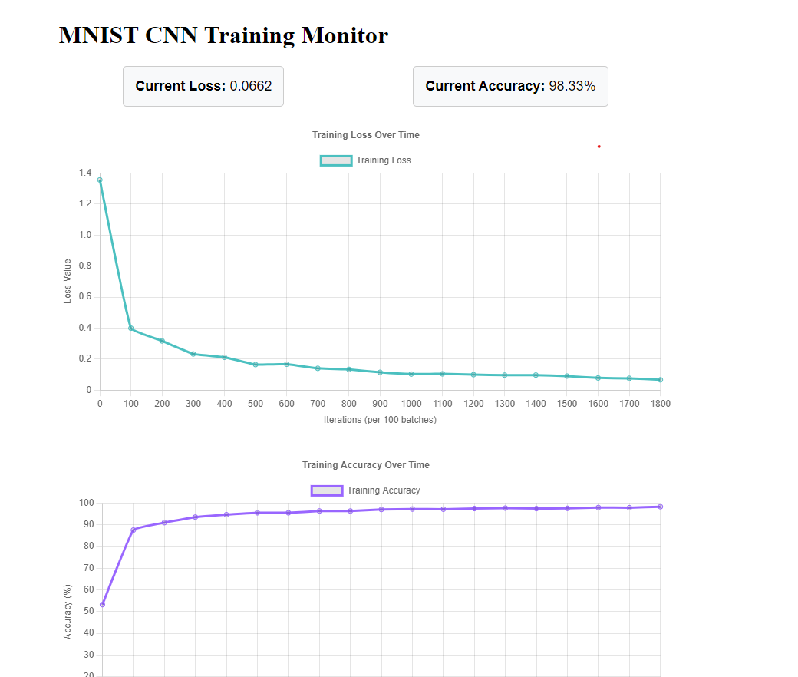


## Project Structure
project/
│
├── model.py # CNN model architecture
├── train.py # Training script
├── visualize_layers.py # Layer visualization tools
├── neuron_analysis.py # Neuron attribution analysis
└── mnist_cnn.pth # Trained model weights


## 1. Layer Visualization (`visualize_layers.py`)

### Key Features:

#### a. First Layer Filter Visualization
- Displays learned filters from the first convolutional layer
- Shows what basic patterns the network looks for
- Shape: [32, 1, 3, 3] (32 filters, 1 channel, 3x3 size)

#### b. Feature Maps
- Visualizes how each layer processes input digits
- Shows activation patterns through the network
- Progressive transformation:
  ```
  Input:     [1, 1, 28, 28]
  Layer 1:   [1, 32, 14, 14]
  Layer 2:   [1, 64, 7, 7]
  Layer 3:   [1, 128, 3, 3]
  Layer 4:   [1, 256, 1, 1]
  ```
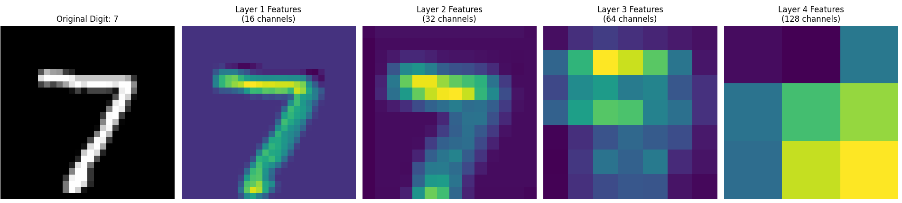

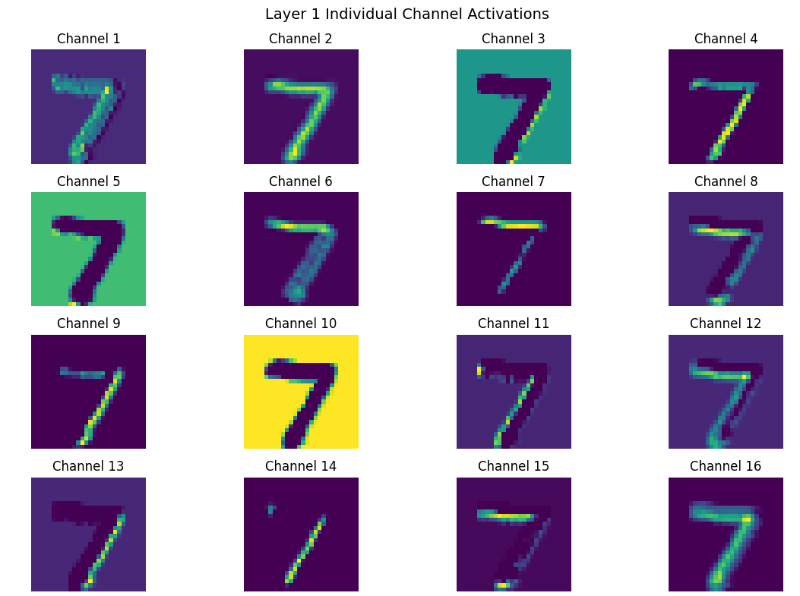

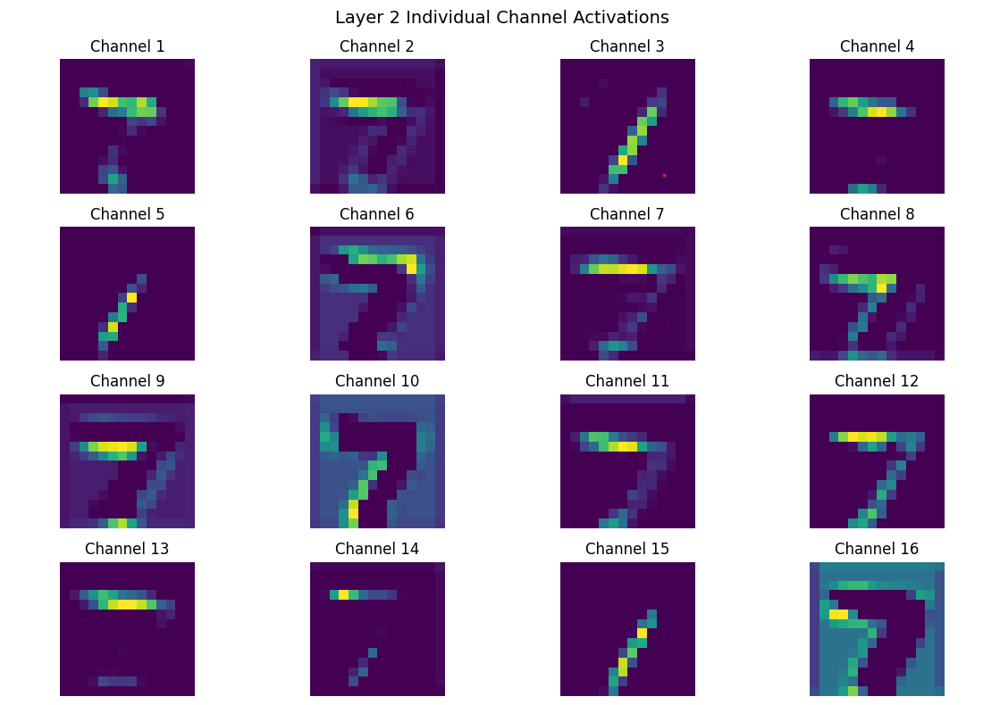

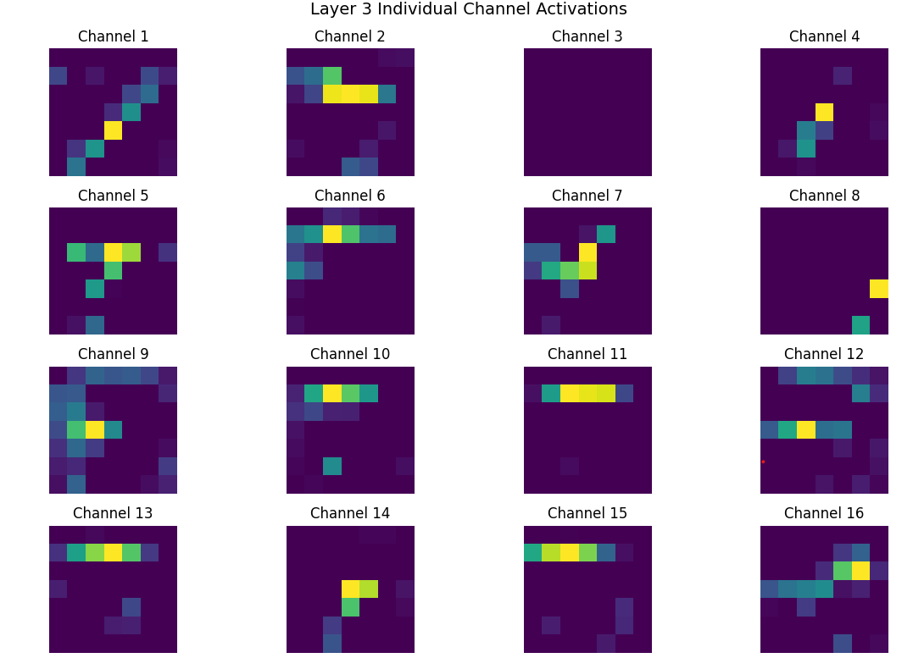


#### c. Layer Responses
- Shows how different layers respond to each digit
- Helps understand layer specialization
- Provides mean activation values per layer

#### d. Decision Making Process
- Visualizes the complete classification pipeline
- Shows feature maps and final probabilities
- Demonstrates how the network makes decisions
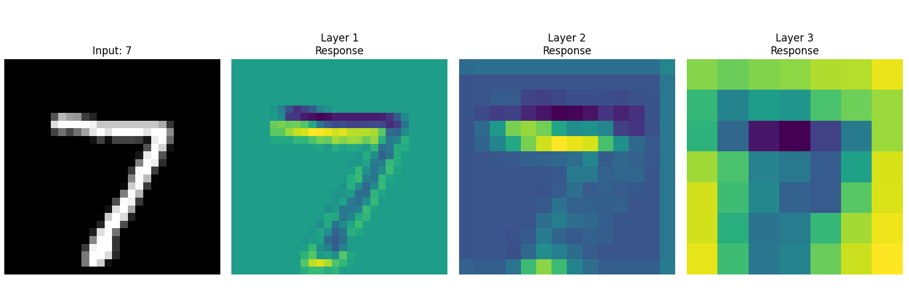
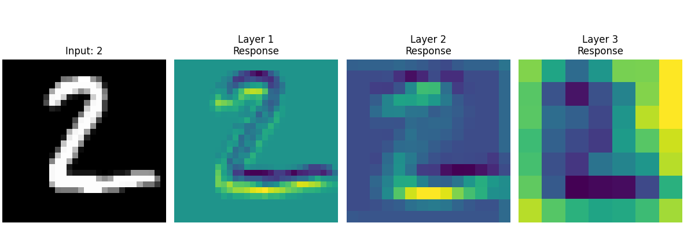
### Usage:
visualizer = LayerVisualizer('mnist_cnn.pth')
View first layer filters
visualizer.visualize_first_layer_filters()
View feature maps for all digits
visualizer.visualize_all_digits()
View layer responses
visualizer.visualize_layer_responses()
View decision making process
visualizer.visualize_decision_making()


## 2. Neuron Attribution Analysis (`neuron_analysis.py`)

### Key Features:

#### a. Neuron Selectivity Analysis
- Identifies neurons specialized for specific digits
- Calculates selectivity scores
- Shows neuron-digit relationships

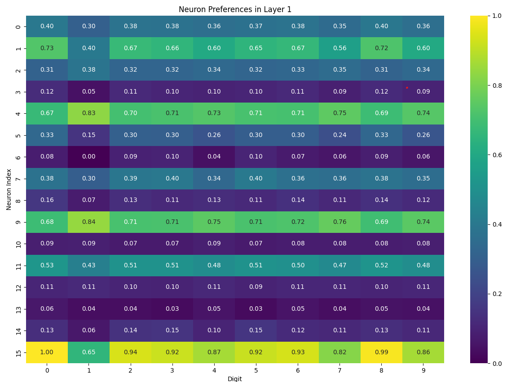
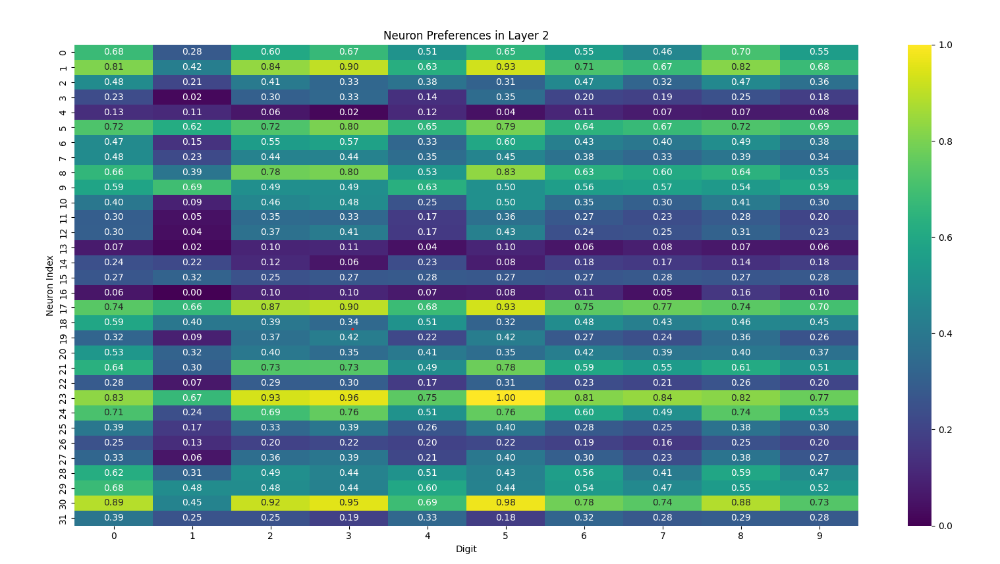

#### b. Activation Pattern Analysis
- Maps neuron responses to different inputs
- Visualizes neuron preferences
- Shows activation distributions

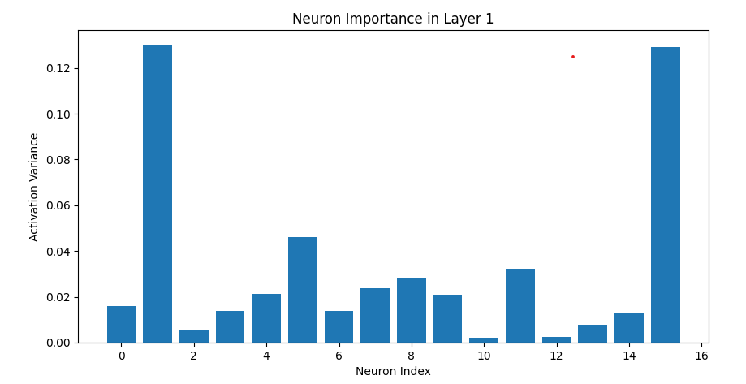

#### c. Top Activations Visualization
- Displays inputs that most activate specific neurons
- Helps understand learned features
- Shows neuron specializations

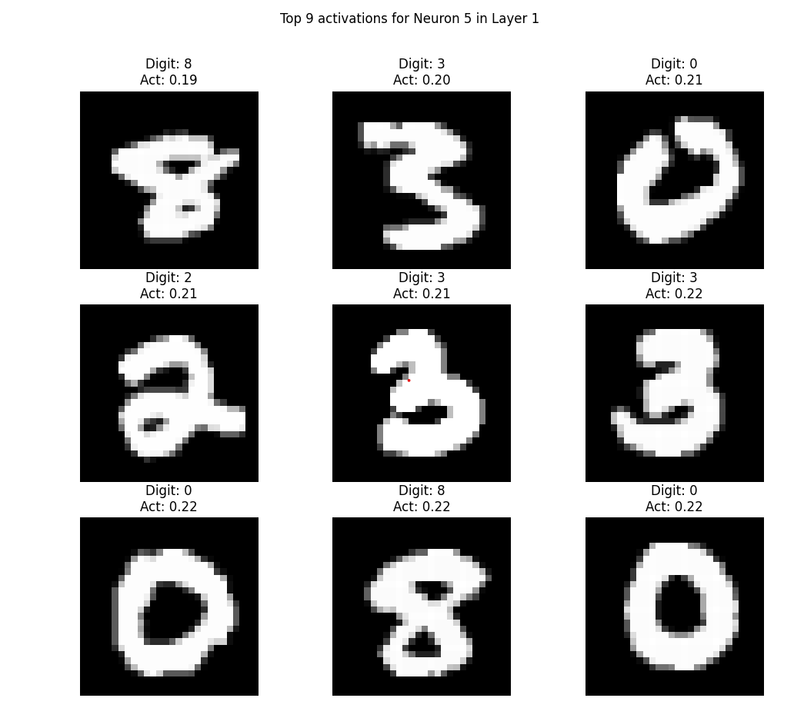

#### d. Neuron Importance Analysis
- Measures contribution of each neuron
- Identifies critical neurons
- Shows activation variance

### Usage:
python
analyzer = NeuronAnalyzer('mnist_cnn.pth')
Analyze specific layer
analyzer.visualize_neuron_preferences(layer_idx=0)
Find selective neurons
selective_neurons, = analyzer.find_selective_neurons(layer_idx=0)
View top activations
analyzer.visualize_top_activations(layer_idx=0, neuron_idx=5)
Analyze neuron importance
analyzer.analyze_neuron_importance(layer_idx=0)

## Key Insights:

1. **Layer Progression**
- Early layers detect simple patterns (edges, curves)
- Later layers combine features for digit recognition
- Spatial dimension reduces while feature channels increase

2. **Neuron Behavior**
- Some neurons specialize in specific digits
- Different layers show different levels of specialization
- Activation patterns reveal learned features

3. **Decision Making**
- Network progressively transforms input
- Feature extraction becomes more abstract
- Final layer provides classification probabilities

## Requirements
- PyTorch
- NumPy
- Matplotlib
- Seaborn
- torchvision